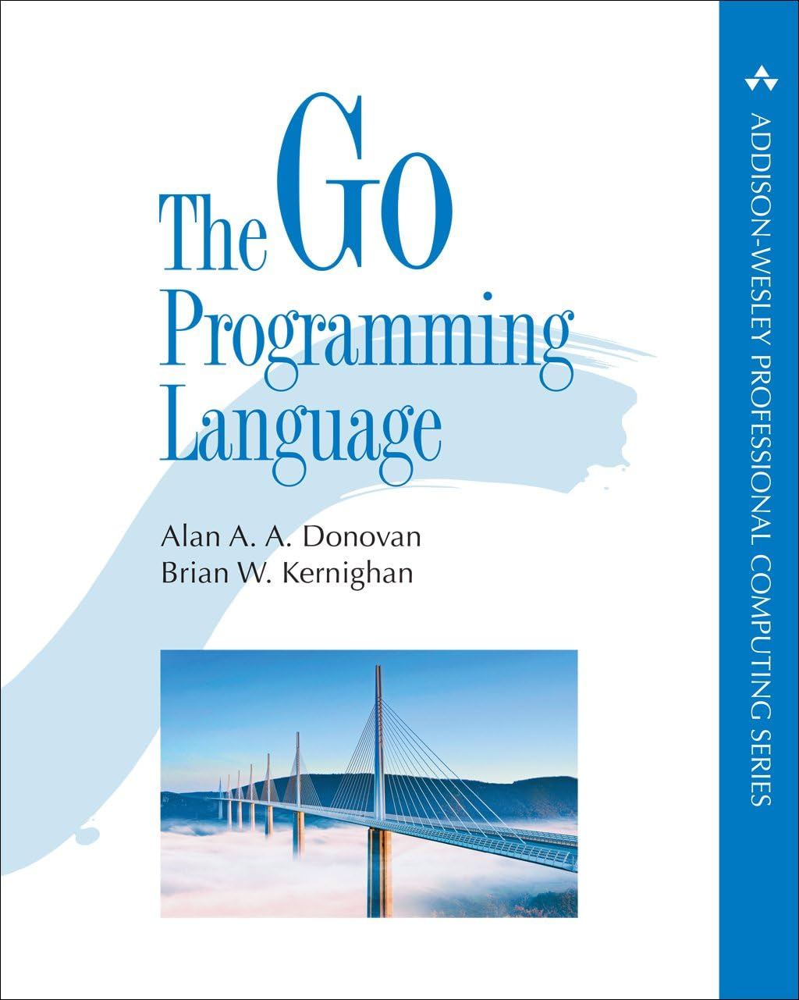

# The Go Programming Language

A collection of exercises and remarks about the book **_'The Go Programming Language'_**\
by Alan A. A. Donovan & Brian W. Kernighan.

    

### Preface

The preface contains some interesting links to Go documentation, resources and tools such as:

- [Go official website](https://go.dev/)
- [The Go Blog](https://go.dev/blog/)
- [The Go Playground](https://go.dev/play/)
- [A tour of Go](https://go.dev/tour/list)

### Chapter 1: Tutorial

#### Section 1.8. Loose Ends

Here we can also find some interesting links:

- [Index of the standard library packages](https://golang.org/pkg)
- [Documentation for packages contributed by the community](https://godoc.org)
